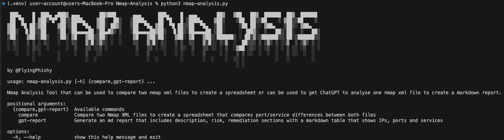
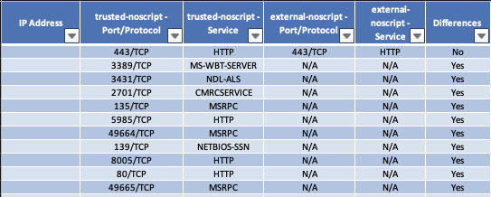
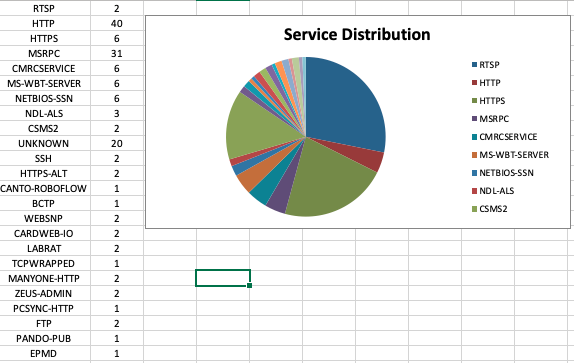
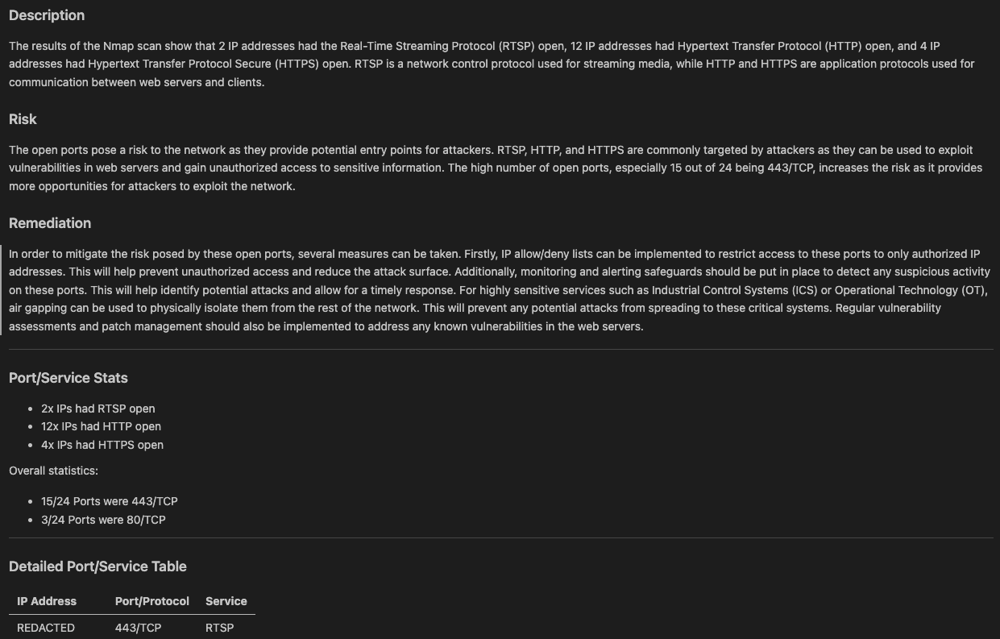
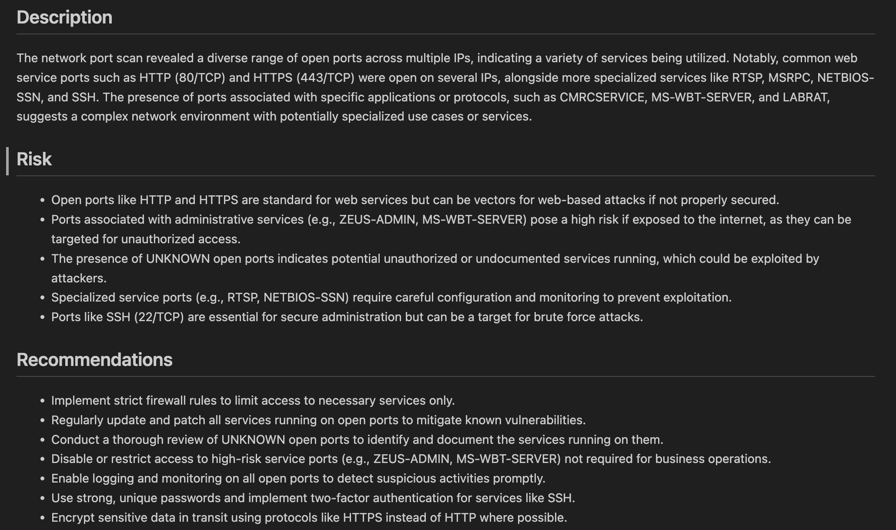

# Nmap Analysis Tool

This CLI python script is designed to be used by security consultants, IT admins and network engineers to do two things, compare two Nmap XML files to create a spreadsheet that compares IPs, ports and services between the files, and create a markdown report using GPT via OpenAI directly or [Daniel Miessler's Fabric tool](https://github.com/danielmiessler/fabric/tree/main).

## Screenshots
### Introduction:


### Spreadsheet:


### Spreadsheet Pie Chart:


### Sample GPT Report:


### Sample AI Report via Fabric:


---
## Features

### Comprehensive Nmap XML Parsing

- **Multiple File Support**: Parse and analyze two Nmap XML output files.
- **Structured Data**: Converts Nmap's XML output into a structured format for further processing.

### Comparative Analysis

- **Change Detection**: Compare results from two Nmap scans to identify new, altered, or removed services and ports. Useful for when you scan the same IPs from different source IPs or over time.
- **Excel Reporting**: Automatically generates detailed Excel spreadsheets with the comparison results and some stats.

### Statistical Overview and Visualization

- **Network Exposure Statistics**: Offers statistical analysis on detected services and open ports.
- **Excel Visualizations**: Includes pie charts in Excel reports for a graphical representation of the network's security posture.

### AI-Powered Insights with GPT

- **GPT Report Generation**: Uses OpenAI's GPT to generate insightful analysis reports based on Nmap result stats. The tool uses a hardcoded prompt that sets the tone and requirements, then the script inserts the stats (no identifying information is provided) and if -c --context has been provided, it'll add the context to the bottom of the prompt.
- **Customizable Context**: Enhance GPT analysis by providing additional context, tailoring the report to specific needs.

### AI-Powered Insights with Fabric
_This function has been implemented but disabled until the pull request is merged. Feel free to uncomment the code if you have manually added the `create_network_threat_landscape` pattern_
- **Fabric Report Generation**: Uses Fabric to generate insightful analysis reports based on Nmap result stats. The tool uses a hardcoded system prompt (pattern) that sets the tone and requirements, then the script inserts the stats (no identifying information is provided). I prefer the output created by Fabric over GPT.

## Usage
The script prints the help page if no args are passed, or you can access with `python nmap-analysis.py -h`. Make sure to create an .env file that contains "OPENAI_KEY=x"

- **Comparing Nmap Scans**:
```
python nmap-analysis.py compare -ff (--first-nmap-file) path/to/first.xml -lf (--last-nmap-file) path/to/second.xml
```

**Generating a GPT Report**:
``` 
python nmap-analysis.py gpt-report -gf (--gpt-nmap-file) path/to/nmap.xml -c (--context) "Your optional context here"
```

**Generating a AI Report via Fabric (uses your chosen model and vendor)**:
``` 
python nmap-analysis.py fabric-report -gf (--gpt-nmap-file) path/to/nmap.xml
```
## Installation and Setup

### Prerequisites

- 3.10+ probably (created using 3.12)
- An OpenAI API key for GPT report generation that is set in local env
- Install and configure [Fabric](https://github.com/danielmiessler/fabric/tree/main)

### Secure Installation with `venv`

1. **Clone the Repository**:
```
git clone https://github.com/yourusername/nmap-analysis-tool.git
cd nmap-analysis-tool
```

2. **Create a Virtual Environment**:
```
python3 -m venv venv
```

3. **Activate the Virtual Environment**:

- On Windows:
```
.\venv\Scripts\activate
```

- On Unix or MacOS:
``` 
source venv/bin/activate
```

4. **Install Dependencies**:
``` 
pip install -r requirements.txt
```

### Alternative: Installation with `pipx`

**Install Nmap Analysis Tool with `pipx`**:

``` 
pipx install git+https://github.com/FlyingPhish/Nmap-Analysis.git
```

## License

This tool is licensed under the GNU Affero General Public License (AGPL). This licensing ensures that the software can be freely used, modified, and distributed for commercial purposes, under the condition that any modifications, extensions, or derivative works are also made available under the same AGPL license. This approach ensures that improvements and extensions contribute back to the community, fostering an open and collaborative development environment.

## Disclaimer

The creators and contributors of the Nmap Analysis Tool provide this software "as is" and make no representations or warranties of any kind concerning the software, express, implied, statutory, or otherwise. This includes, without limitation, warranties of title, merchantability, fitness for a particular purpose, non-infringement, or the absence of latent or other defects, accuracy, or the presence or absence of errors, whether or not discoverable.

Usage of the Nmap Analysis Tool is entirely at your own risk. The creators or contributors shall not be liable to you for damages of any kind related to the use or inability to use this software, including but not limited to direct, indirect, special, incidental, consequential, or punitive damages, even if they have been advised of the possibility of such damages.

## Contributing

Contributions are welcome! Whether it's adding new features, fixing bugs, or improving documentation, feel free to fork the repository and submit pull requests.